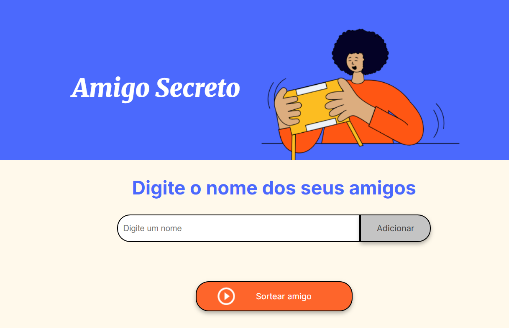
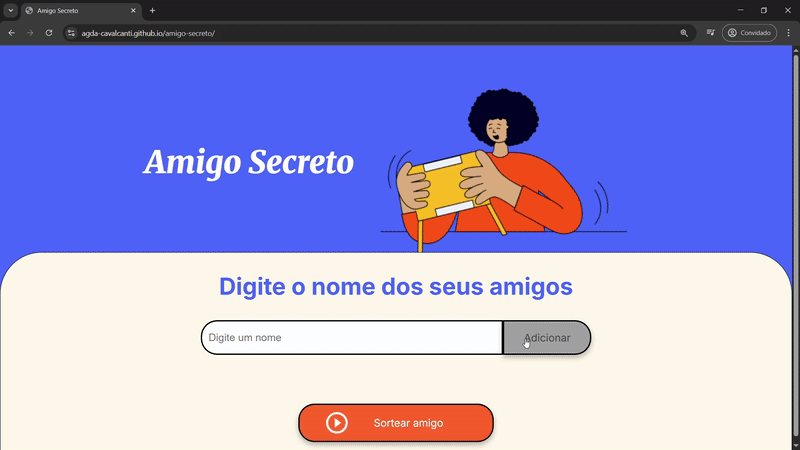

<h1 align="center"> Amigo Secreto </h1>

# Descrição do projeto

O sistema tem como objetivo <b>realizar um sorteio de uma lista de amigos que é inserido pelo usuário.</b>

Este projeto foi desenvolvido como parte do <b>Challenge Amigo Secreto proposto pelo programa ONE, parceria de Alura + Oracle.</b> O objetivo era atender aos requisitos estabelecidos no desafio, garantindo que todas as funcionalidades essenciais fossem implementadas.

<h4 align="center"> :heavy_check_mark: Projeto Finalizado :heavy_check_mark:</h4>

# Índice 

* [Descrição do projeto](#descrição-do-projeto)
* [Funcionalidades e Demonstração da Aplicação](#funcionalidades-e-demonstração-da-aplicação)
* [Acesso ao Projeto](#acesso-ao-projeto)
* [Tecnologias utilizadas](#tecnologias-utilizadas)
* [Autores](#autores)
* [Pessoas Contribuidoras](#pessoas-contribuidoras)
* [Futuras melhorias](#futuras-melhorias)
* [Conclusão](#conclusão)

# Funcionalidades e Demonstração da Aplicação

- `Funcionalidade 1`: <b>Adicionar amigos:</b> permite ao usuário inserir um nome no campo de texto e adicioná-lo à lista de amigos.
- `Funcionalidade 1a`: <b>Armazenar amigos:</b> criação de variável do tipo array, que armazenará os nomes dos amigos inseridos.
- `Funcionalidade 1b`: <b>Validar a entrada:</b> uma validação para garantir que o campo não esteja vazio. 
- `Funcionalidade 3`: <b>Limpar campo:</b>  após adicionar o nome, redefine o campo de texto para uma string vazia.
- `Funcionalidade 4`: <b>Atualizar a lista de amigos:</b> percorre o array de amigos e adiciona cada nome como um elemento <li> dentro de uma lista HTML.(Essa função é chamada toda vez que um novo amigo é adicionado)
- `Funcionalidade 4a`: <b>Limpar a lista existente:</b> limpa a lista antes de adicionar novos elementos para garantir que não haja duplicados ao atualizar.
- `Funcionalidade 5`: <b>Sortear amigos</b>: seleciona aleatoriamente um dos nomes armazenados no array amigos, usando Math.random() e Math.floor() para obter um índice aleatório.
- `Funcionalidade 5a`: <b>Validar que há amigos disponíveis:</b> antes de sortear, verificar se o array amigos não está vazio. 
- `Funcionalidade 5b`: <b>Mostrar o resultado:</b> Atualizar o conteúdo do elemento de resultado usando document.

# Demonstração do projeto

# Acesso ao projeto
[MEU SITE ESTÁ NO AR!](https://agda-cavalcanti.github.io/amigo-secreto/)

# 🛠️ Abrir e rodar o projeto

Para ter acesso a edição do código você pode cloná-lo, segue o link do tutorial:

[Clonando um repositório com Git e GitHub](https://www.alura.com.br/artigos/clonando-repositorio-git-github?srsltid=AfmBOoosXYuiZSdsKFgTTRPat5AQqAa0FeEg3MM2zW5S2Z9DMZJ2QCU2)

# Tecnologias utilizadas
- Visual Studio Code (IDE)
- JavaScript 
- HTML 
- CSS
- GitHub Pages (Hospedagem da página)
- Trello 

# Autores

[ Agda Cavalcanti](https://github.com/Agda-Cavalcanti) 

# Pessoas Contribuidoras

  A <strong>Alura</strong> disponibilizou o HTML e o CSS do projeto, permitindo que os esforços fossem dedicados apenas à lógica, que é o principal objetivo de aprendizado.

  

# Futuras melhorias

:heavy_check_mark: O projeto foi concluído conforme os requisitos do challenge, mas com oportunidades de melhorias.

Embora tenha cumprido todas as exigências do desafio, identifiquei algumas áreas que podem ser aprimoradas, como:

- Fazer outro sorteio sem repetir os nomes.
- O campo do resultado do sorteio deve ser limpo quando tiver outro sorteio, não mostrando os resultados anteriores para o usuário (Essa funcionalidade é útil se for utilizado por um grupo de amigos, cada um pode então sortear o seu amigo secreto).  
- Colocar a lista de nomes em outro lugar da tela para melhorar a visualização dos nomes e do botão de sortear.
- Opções para alterar e excluir nomes.

# Conclusão

Este challenge foi uma excelente oportunidade de aprendizado e prática dos conceitos anteriormente estudados.  Pude aperfeiçoar o conceito de lógica de programação, consolidar meus conhecimentos, dominar o pensamento lógico, aprimorar as habilidades de análise e resolução de problemas, além de ampliar minha perspectiva no mundo do desenvolvimento.

